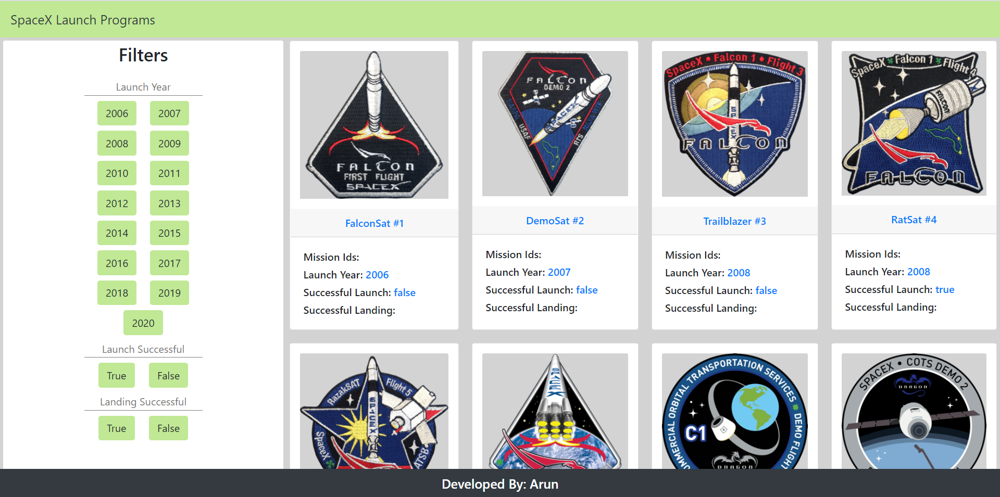

# SpaceX-Data-Program

SpaceX API-Consumption

> ### Angular codebase containing All Launches by SpaceX program.

### [Demo](https://spacex-data-webpage.netlify.app)

This codebase was created to demonstrate a fully fledged web page for all the launches for the SpaceX program built with Angular that interacts with an actual backend Api with some filter operations like Year filter, launch filter and landing filter.

# How it works

The codebase should be straightforward to follow as is.

### Making requests to the backend API

The live API server running at https://api.spaceXdata.com/v3/launches?limit=100 for the application to make requests against.

If you want to change the API URL to a local server, simply edit `src/environments/environment.ts` and change `baseUrl` to the local server's URL

# Getting started

Make sure you have the [Angular CLI](https://github.com/angular/angular-cli#installation) installed globally. And use [npm](https://www.npmjs.com/get-npm) to manage the dependencies, then run `npm install` to resolve all dependencies (might take a minute).

Run `npm run format` for a formatting the code using [prettier](https://www.npmjs.com/package/prettier). It will automatically format the code and save the changes.

Run `ng serve` for a dev server. Navigate to `http://localhost:4200/`. The app will automatically reload if you change any of the source files.

### Building the project

Run `ng build` to build the project. The build artifacts will be stored in the `dist/` directory. Use the `-prod` flag for a production build.

## Functionality overview

The application can be used for visualizing the SpaceX Launch program's data. It uses a custom API for all requests. You can view a live demo over at https://spacex-data-webpage.netlify.app

**General functionality:**

- On the first load of the page, a request is made to the API for 100 objects of the data.
- When year, launch and/or landing filters are selected, the relevent data is displayed.
